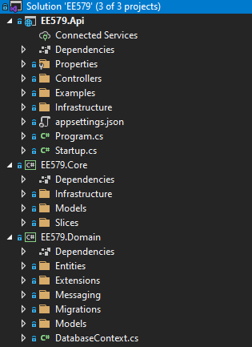
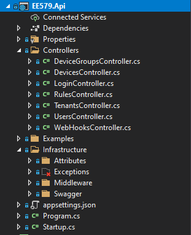
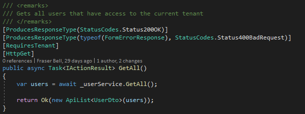
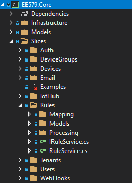

# API

## Framework and Language

The API was built using the framework ASP.NET Core, built on top of Microsoft’s increasingly trending language, C#. ASP.NET Core is an web API specific framework that extends .NET Core. We are using .NET 5. 

## Running the API

1. First install Visual Studio from [here](https://visualstudio.microsoft.com/downloads/)
2. Pull our API with `git clone https://github.com/fraserb99/ee579-api.git`
3. Navigate into the EE579 directory
4. Open EE579.sln with Visual Studio. Visual Studio should automatically install all the necessary dependencies
5. Press the green play button on the top toolbar to run the API. This starts the API on localhost:5001

## Understanding the API's Architecture and Directory Structure

The API is organised into three modules: Api, Core and Domain. The root directory structure for each module is shown below:

* The API module contains functionality related to basic input/output in the API as well as launch configurations and application settings.
* The Core module contains all the API logic for handling requests.
* The Domain module contains all the mapped database entity objects. An object representation of the database is also stored at the root level in DatabaseContext.cs.

### API Module

Above, is the API Module with some of its main directories expanded. Within the Controllers directory, lies all the Controllers for the API. A controller is a class that contains methods for the entry points for all our different endpoints. Controllers are split into their category. For example, all endpoints to do with users, such as getting a list of all users in the tennant, lie within the UsersController class. This get all endpoint within the UsersController can be seen below:

We can see that there are various "attributes" above the method definition. Attributes can be used for various attribution related configuration to do with a particular method. In this case, there is the [HttpGet] attribute that defines this method as a GET request. You can find out more about attributes [here](https://docs.microsoft.com/en-us/aspnet/core/mvc/controllers/filters?view=aspnetcore-5.0). Within the methody body, a call to the method GetAll() is invoked upon the user service. This returns a list of user objects. More about services and dependency injection will be covered later. On the last line of this controller method, the list of users is returned to the front end. ASP.NET Core automatically serialises the list of user objects to JSON behind the scenes. 

Moving back up one directory from the Controllers directory, is the Infrastructure directory. Within this directory contains definitions for custom attributes, exceptions, middleware that handles status codes, and as well as the swagger documentation configurations. In the route directory of the API module, lies two important classes: Program and Startup. Program launches the API and boostraps the Startup class. Within Startup contains many API configurations, service registering and authorization handling. Things such as CORS policies and bearer token authentication go in here. 

### Core Module

Above, is the Core Module with some of its main directories expanded. At the highest directory level, is Infrastructure, Models and Slices. Similar to the Infrastructure directory in the API module, this directory contains classes that provide functionality to the system as a whole. Such as general utlity method overrides and extensions etc. 

## Database 

