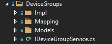
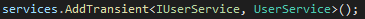
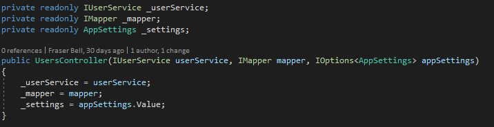
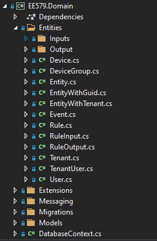

# API

## Framework and Language

The API was built using the framework ASP.NET Core, built on top of Microsoft’s increasingly trending language, C#. ASP.NET Core is an web API specific framework that extends .NET Core. We are using .NET 5. 

As we have followed industry level design and architectural patterns for ASP.NET Core web APIs, anyone with any ASP.NET Core experience should be able to pick up our API without knowing detailed knowledge of the component level logic. To learn more about ASP.NET Core, see [here](https://docs.microsoft.com/en-us/aspnet/core/?view=aspnetcore-5.0).

## Running the API

1. First install Visual Studio from [here](https://visualstudio.microsoft.com/downloads/)
2. Pull our API with `git clone https://github.com/fraserb99/ee579-api.git`
3. Navigate into the `EE579` directory
4. Open `EE579.sln` with Visual Studio. Visual Studio should automatically install all the necessary dependencies
5. Press the green play button on the top toolbar to run the API. This starts the API on localhost:5001

## Understanding the API's Architecture and Directory Structure

The API is organised into three modules: Api, Core and Domain. The root directory structure for each module is shown below:

* The `API` module contains functionality related to basic input/output in the API as well as launch configurations and application settings.
* The `Core` module contains all the API logic for handling requests.
* The `Domain` module contains all the mapped database entity objects. An object representation of the database is also stored at the root level in `DatabaseContext.cs.`

### API Module

Above, is the API Module with some of its main directories expanded. Within the `Controllers` directory, lies all the controllers for the API. A controller is a class that contains methods for the entry points for all our different endpoints. Controllers are split into their category. For example, all endpoints to do with users, such as getting a list of all users in the tennant, lie within the `UsersController` class. This get all endpoint within the UsersController can be seen below:

We can see that there are various "attributes" above the method definition. Attributes can be used for various attribution related configuration to do with a particular method. In this case, there is the `[HttpGet]` attribute that defines this method as a GET request. You can find out more about attributes [here](https://docs.microsoft.com/en-us/aspnet/core/mvc/controllers/filters?view=aspnetcore-5.0). Within the methody body, a call to the method `GetAll()` is invoked upon the user service. This returns a list of user objects. More about services and dependency injection will be covered later. On the last line of this controller method, the list of users is returned to the front end. ASP.NET Core automatically serialises the list of user objects to JSON behind the scenes. 

Moving back up one directory from the `Controllers` directory, is the `Infrastructure` directory. Within this directory contains definitions for custom attributes, exceptions, middleware that handles status codes, and as well as the swagger documentation configurations. In the route directory of the API module, lies two important classes: `Program` and `Startup`. `Program` launches the API and boostraps the `Startup` class. Within `Startup` contains many API configurations, service registering and authorization handling. Things such as CORS policies and bearer token authentication go in here. 

### Core Module

Above, is the `Core` Module with some of its main directories expanded. At the highest directory level, is `Infrastructure`, `Models` and `Slices`. Similar to the `Infrastructure` directory in the `API` module, this directory contains classes that provide functionality to the system as a whole. Such as general utlity method overrides and extensions etc. 

`Models`, is a directory for data objects. The classes typically should only contain properties and not give any functionality around them. A `Models` directory, can be seen in multiple different places and levels within the API. This is for organisational purposes, for example, all models associated with users will be within a `Models` directory within the `Slices/Users` directory. 

Within the `Slices` directory, contains the bulk of the API logic. In the context of the API, a slice, is a grouped section (or slice) of the API, where the grouping is organised by entity relation, such as users, rules, devices etc. That is, all logic handling with regards to that entity, is contained in its own slice.

We can see above the `DeviceGroups` slice directory expanded. This shows a typical architecture for a slice. Within contains:

* A `Mapping` directory containing mapping profiles that define behaviour for mapping one object to another (with regards to this slice). 
* Another `Models` directory containg all data objects associated with this slice. 
* An `Impl` directory (short for implementation) that contains the service class for this slice that implements the respective service interface.
* The respective service interface with regards to this slice. 

#### Services

So what actually *is* a service? A service is a logic component used by the API. It is good practice to create a service for every slice in the API. In simple terms, the service will provide functionality and methods for interacting and manipulating the respective entity in that slice. So for example, the user service will have methods for getting a user from the database, creating a new user in the database, updating a user and so forth. The key thing that differentiates a service from a conventional class, is that services get registered in the aforementioned Startup class and can thereby be **dependency injected** into other classes such as controllers or even injected into other services.

##### Dependency Injecting Services

**Dependency injection** is when an object receives additional objects it depends on. For example, the `UsersController` needs access to the `UsersService` so that when a request to get a user is received, it can call this method on the user service which will return the user. For this to be possible, two steps are required:

1. **Register the class as a service in Startup.cs** - This is done like so within the `ConfigureServices` method in `Startup.cs`:

This tells the API that the interface `IUserService` is parent to the `UserService` implementation. AddTransient means that upon every request to the API, ASP.NET Core will inject an instance of `UserService` with type `IUserService` into all objects that depend on it. AddTransient is so called named due to the transient lifecycle of the injected object. That is, after the request has finished execution, .NET will perform clean up and garbage collection to free up memory. It is injected with type `IUserService` rather than the `UserService` type itself because programming to the interface gives greater code decoupling and abstraction providing a well architectured and maintainable design. 
2. **Receive the injection within an object** - Receiving a dependency happens within the constructor of the class. This is shown below:

You can see above, that the constructor for the `UsersController` takes an `IUserService` as one of its parameters. What gets passed in for this type, is then set as an instance variable. This is the user service dependency. But then where does the `IUserService` get passed in from? Because of the AddTransient method call made in `Startup.cs` in step 1, ASP.NET Core knows to look for all contructors that take the type `IUserService` as a parameter and will pass in an instance of UserService whenever a request to the API is made. This is seamless to the programmer, one of the benefits of such a design pattern. The dependency can then be interacted with using the instance variable, in this case the `_userService` reference.

### Domain Module

Above is the directory structure of the domain module with the `Entities` directory expanded. The `Entities` directory contains object representations of database entities. These entity classes are mapped from the database and vice versa. This is achieved by the use of Entity Framework Core or EF Core for short.

#### EF Core

Entity Framework Core is an object relational mapper. This means that it can map database tables to lists of objects where an object is an entry in the table. For example, a users table with 3 columns: id, username and password would get mapped to a list of `User` objects. Where a `User` object would have propeties of `id: int`, `username: string` and `password: string`. By interacting with these objects within the API in a conventional object orientated fashion, EF Core will update the database seamlessly behind the scenes. For example, to update the password of a user with `id` 1, you would search through the list of `User` objects until you find a `User` with its `id` property value equal to 1 and then updating the password on this selected object. EF Core will then update the database to reflect this change. For creating a `User` it is as simple as adding a new `User` object to the list of users.

#### Migrations

But then how does the database schema stay in sync with the object representation in the API? Keeping the two domains in sync is inherently simple using the [Code First](https://www.entityframeworktutorial.net/code-first/what-is-code-first.aspx) design approach with EF Core Migrations. Code First means that the database schema is reflective of the API domain entities rather than the API domain entities updating to match the database schema. For example, to add a new column/propert to the User domain object (and thus the database) the following steps are required:

1. Open the `User` domain object in Entities/User.
2. Add a new field to the class. E.g `email: string`.
3. In the terminal in Visual Studio, run the command `Add-Migration AddedAnEmailColumn`.
..* This will generate some simple code that will add an `email` column to the database. It is worth quickly reviewing this to make sure it is what you want to do.
4. Run `Update-Database` this will execute the migration code and add the column to the database.

When the API starts up, it will automatically check to make sure it has applied all the latest migrations. This ensures that the database always matches the object representation in the code.
