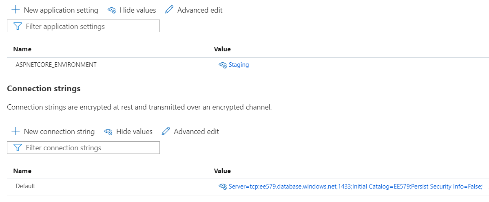

# Cloud Architecture

## Cloud Provider

The majority of the cloud components of this system are currently hosted on the Microsoft Azure platform. The cloud provider is not tightly coupled to the application for the most part, so you are free to use the provider of your choice. The only exception to this is for IoT Hub and consequently [Event Hubs](https://docs.microsoft.com/en-us/azure/iot-hub/iot-hub-devguide-messages-read-builtin), for which more information can be found [here](#iot-hub). It should also be noted that this docs site is hosted using [GitHub Pages](https://pages.github.com/) - more detail about how this works can be found in the [Docs Site Section](#docs-site).

The Azure Portal is available at [portal.azure.com](https://portal.azure.com) and can be used to create and manage cloud resources.

## Architecture Overview


This diagram shows how the cloud services integrate with each other. This section will detail how each of these services is hosted to allow you to replicate the hosting setup on the provider of your choice.

### API

The API is hosted as an [Azure App Service](https://azure.microsoft.com/en-gb/services/app-service/). This is a Platform-as-a-Service (PaaS) offering from Azure that enables applications to be run without having to configure the underlying server as everything like the web server config is handled behind-the-scenes by Azure. Before an App Service can be created, an [App Service Plan](https://docs.microsoft.com/en-us/azure/app-service/overview-hosting-plans) must be created. App Service Plans can contain multiple App Services, with the scale being configured at the App Service Plan level.

The following screenshot shows an example configuration for an App Service Plan.


The only options that must be set as shown in the screenshot are the `Publish: Code` and `Runtime Stack: .NET 5` options. All of the rest are up to you. Our API has cross-platform support and can run on Windows or Linux. We cannot provide any direct instructions as we have not done it, but the API can be hosted on other providers like AWS, or alternatively can be run on a local server running IIS, Kestrel, or another web server.

There are several environment variables that must be set for the API to function correctly. If you are hosting the app on an App Service, it is as simple as setting 2 values in the configuration section of the App Service:



If you are hosting on another service then the environment variables should be set directly with the following names:

* **`ASPNETCORE_ENVIRONMENT`** - This should be set to `Staging`
* **`ConnectionStrings__Default`** - This should be the connection string for your database

You may also need to edit some values in `appsettings.Staging.json`. The values from this file get loaded as configuration options.

``` json linenums="13"
    "AppSettings": {
        "AdminUrl": "https://www.ee579-group4.net",
        "ApiUrl": "http://ee579-dev-api.azurewebsites.net",
        "SmtpSettings": {
            "EmailEnabled": true,
            "Host": "smtp.gmail.com",
            "Port": 587,
            "Email": "ee579.ifttt@gmail.com",
            "Password": "**********"
        }
    }
```

For example, if you are hosting the API on another URL, you should change the `"ApiUrl"` value to reflect this. You can also change the Smtp server used for sending email here.

### Database

We are using Azure SQL to host our database, a cloud database service using Microsoft's [SQLServer](https://docs.microsoft.com/en-us/sql/sql-server/?view=sql-server-ver15). You are in no means tied to this SQL variation, however. One of the benefits of using EF Core is that it abstracts the database itself from the code. This means that you are free to use any of the [supported database providers](https://docs.microsoft.com/en-us/ef/core/providers/?tabs=dotnet-core-cli).

To use a different database provider, you should first set the connection string as described in the previous section. You then must also change the following line in [`Startup.cs`](https://github.com/fraserb99/ee579-api/blob/develop/EE579/EE579.Api/Startup.cs) where the database connection is configured.

``` csharp linenums="155" hl_lines="5"
private void ConfigureEfCore(IServiceCollection services)
{
    services.AddDbContext<DatabaseContext>(opts =>
        opts.UseLazyLoadingProxies()
            .UseSqlServer(Configuration.GetConnectionString("Default")));
}
```

Change this to use the corresponding function, e.g., `UseSqlite` if you are using a Sqlite database.

### Web Interface

The web interface is hosted as an [Azure Static Web App](https://azure.microsoft.com/en-gb/services/app-service/static/). Azure Static Web Apps allow static sites to be hosted without using a web server. This is especially useful when the site is an SPA - [as described here](front-end.md#single-page-applications). SPAs don't require any processing to be performed on the server to serve the response, the server only needs to return the file containing the client-side code. Static Web Apps allow these files to be served through the use of a CDN, providing users with extremely fast page load times.

*[CDN]: Content Delivery Network

The site can also be hosted on a traditional server as well. Running `npm build` will generate a production-ready, minified build containing an `index.html` with references to the minified javascript files. This build can then be deployed to the wwwroot folder of any web server and served.

There is an additional piece of configuration required when configuring the web server running the site. Because the React app is an SPA, the web server only sees a single `index.html` file so assumes that the only root is the default `/`. This means that if someone navigates to `/sign-up` for example, the web server will not find a `sign-up.html` file, so will return a 404. To fix this we must route all requests to `/`. If hosting using a Static Web App, this can be done using a `routes.json` file in the `/public` folder.

=== "routes.json"

    ``` json
    {
        "routes": [
            {
                "route": "/*",
                "serve": "/index.html",
                "statusCode": 200
            }
        ]
    }
    ```

The method for doing this may vary between web servers. to take IIS as an example, a `web.config` file can be used to configure the routing.

=== "web.config"

    ``` xml
    <?xml version="1.0" encoding="utf-8" ?>
    <configuration>
        <system.webServer>    
            <rewrite>
                <rules>
                    <remove name="pushState" />
                    <rule name="pushState" stopProcessing="true">
                        <match url=".*" />
                            <conditions logicalGrouping="MatchAll">
                            <add input="{REQUEST_FILENAME}" matchType="IsFile" negate="true" />
                            <add input="{REQUEST_FILENAME}" matchType="IsDirectory" negate="true" />
                            </conditions>
                            <action type="Rewrite" url="/" />
                        </rule>
                </rules>
            </rewrite>
        </system.webServer>
    </configuration>
    ```

### IoT Hub and Event Hubs

!!! note
    The IoT Hub setup is somewhat involved and requires more setup than the other components. If you are looking to replicate our cloud architecture we recommend that you continue to use our IoT Hub to simplify setup on both devices and the server.

IoT Hub implements a publish-subscribe pattern, used in this system to facilitate communication between the IoT devices and server.

IoT Hub is not a traditional MQTT broker, so to read messages sent from devices the server cannot just subscribe to their topics. Instead, IoT Hub exposes these messages through an  [Event Hub built-in-endpoint](https://docs.microsoft.com/en-us/azure/iot-hub/iot-hub-devguide-messages-read-builtin). The API then reads the messages from this Event Hub endpoint and processes them asynchronously.

A Blob Storage Account is also required to read messages from the built-in-endpoint. This is used to store checkpoint files which allow the API to keep its place in the message queue, like a bookmark. This prevents messages from being read twice. The storage account was omitted from the architecture diagram for brevity.

IoT Hub also allows you to expose device connection state events by routing them through an Event Hub. This means that when a device connects to the IoT Hub, a connection state message is routed to the corresponding Event Hub. Our application then reads the messages from this endpoint and updates the corresponding device's connection state in the database. This connection state is then displayed in the UI as shown [here](devices.md#managing-existing-devices).

If you do create your own IoT Hub, Event Hub, and storage account, simply change the connection strings in [`IotHubWorkerService.cs`](https://github.com/fraserb99/ee579-api/blob/develop/EE579/EE579.Core/Slices/IotHub/IotHubWorkerService.cs) and [`IotMessagingService.cs`](https://github.com/fraserb99/ee579-api/blob/develop/EE579/EE579.Domain/Messaging/IotMessagingService.cs) to point to your resources.

### Docs Site

The docs site is the site this documentation is currently available from - [docs.ee579-group4.net](https://docs.ee579-group4.net). This site is created using [MkDocs](https://www.mkdocs.org/), a static site generator that converts [Markdown](https://daringfireball.net/projects/markdown/) files into a static site composed of html, css, and javascript.

Unlike the other components, this site is not hosted on Azure. Instead, GitHub pages is used. MkDocs provides easy integration with GitHub pages through their CLI. The following commands show how you can contribute to the documentation and deploy it.

1. 
```
pip install mkdocs && pip install mkdocs-material
```

2. 
```
git clone https://github.com/fraserb99/ee579-docs.git
```

3. 
```
cd ee579-docs
```

4. 
```
mkdocs serve
```

5. Make any changes you would like at this point

3. 
```
mkdocs gh-deploy
```