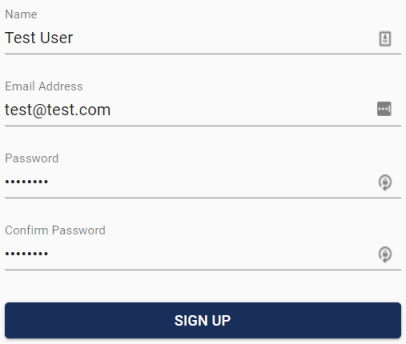

# Create an Account

Visit [https://www.ee579-group4.net/signup](https://www.ee579-group4.net/signup) to get started. 

There are several methods available for signing in:

#### Username and Password

To create an account with a username and password, fill out the form on the sign up page. 

You will then be sent an email to verify that you have access to the email address. You must then click the link in the email before you can sign in.

#### External Providers

Logging in with an external provider allows you to reduce the number of passwords and accounts you have to manage. This site allows you to sign in with your Google or Microsoft account. Click the respective button to start the external sign in process. You will then be redirected to the external providers site where you can sign in.

After signing in to the external providers account, you will be redirected back to this site and signed in. Verifying your email is not required when using external sign in as signing into the account verifies that you have access to the email.

## Next Steps

* Learn about how [Multi-Tenancy](multi-tenancy.md) works in this application