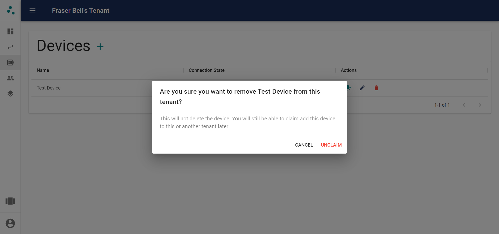

# Devices

Devices are the devices that will be used in rules. They send inputs to the API and receive messages to perform outputs.

## Adding Devices

Before devices can be used to create rules, they must be claimed by a tenant. The first step is to power the device on. When powered on for the first time, the device will register itself with the system, making it possible to claim it in the web interface.

After the device has been powered on, navigatet to the devices page and click the add button above the table. This shows the modal below.

This shows the devices available for you to claim. You must be on the same network as a device in order to claim it. This prevents other users from claiming devices that do not belong to them. The devices are listed by their MAC address which you may use to identify specific devices when multiple are available. If you do not know the MAC address of your device you can press the lightbulb button. This will flash an LED on the device for 5 seconds, allwoing you to identify which device the list item corresponds to.

To claim a device press the add button next to its MAC address. This will bring up a form allowing you to give the device a user friendly name before claiming it.

## Managing Existing Devices

After devices have been added, they will be visible on the devices page as shown below.

This page allows you to view all of your devices and their current state. The 'Connection State' column shows whether the device is currently connected to the MQTT broker and able to send and receive inputs and outputs. It also allows you to preform some actions on the device. Here you may identify a device in the same way as when claiming it, by pressing the LED button. You can also change the device's name and unclaim it from the current tenant.

### Unclaiming a Device

You may wish to unclaim a device from a tenant. This removes the device from its current tenant, and removes it from any rules it may have been involved in. This does not delete the device completely, only resets it, allowing it to be claimed by another tenant. If you want to move a device from one tenant to another this would be the way of doing that.

## Device Groups

Device groups provide a method of grouping devices with similar functions to improve the process of adding and managing rules.

Device groups can be added by specifying a name, and list of devices that should be long to the group. The name and devices can also be edited later.

# Next Steps

* Find out how [Rules](rules.md) work