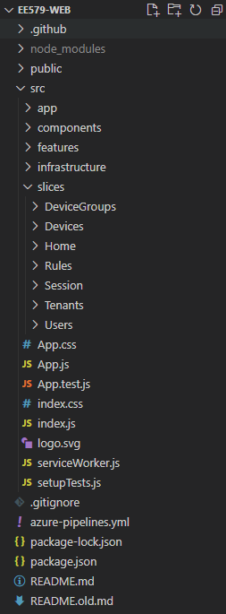
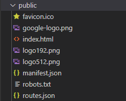

# React Front End

## Language and Framework

The web interface (or front end) for this system is written in React. React is a javascript framework that enables developers to easily build responsive front ends with its component-based architecture. It is created and maintained by Facebook. Detailed React documentation can be found [here](https://reactjs.org/).

### Single Page Applications

Single Page Applications (SPAs) are a type of web application, along with server-rendered (or multi-page) applications. Traditional websites use server side rendering to load a new page every time the user navigates to a different URL - this page will consist of HTML and any other related files (css, javascript, etc.). In contrast, SPAs use client side languages to dynamically change the web page content without a request to the server. Instead, the client side scripts (most commonly in the form of javascript) are loaded on the first page load and the required data is then loaded from an external API. React supports both server-side rendering and SPAs. THe SPA approach is used in this project as it allows for a more responsive site as the user does not have to wait for a request to be made on every navigation. It is important to understand how SPAs work in order to understand how they can be [hosted on the cloud](cloud-architecture.md)

## Running the Site

**Prerequisites**

* [NodeJS](https://nodejs.org/en/) > v10

First, clone the [github repository](https://github.com/fraserb99/ee579-web):

```
git clone https://github.com/fraserb99/ee579-web.git
```

Change directory to the cloned repo:

```
cd ee579-web
```

Then install the required npm packages:

```
npm i
```

Then run the application:

```
npm start
```

Your browser should now open at `http://localhost:3000`, displaying the site. [Run the API](api.md) alongside this in order for all functionality to work

## Application Structure

The folder structure of the application is shown below:



### package.json

The `package.json` file is automatically generated and stores information about the installed npm packages and their versions. Wen a new package is installed via `npm i`, this file is updated. React-specific script references are also stored in the scripts section

``` json linenums="44"
    "scripts": {
        "start": "react-scripts start",
        "build": "react-scripts build",
        "test": "react-scripts test",
        "eject": "react-scripts eject"
    },
```

This allows the project to be built and run with `npm start`

### `/public`



This folder contains the `index.html` used by the [React DOM](https://reactjs.org/docs/react-dom.html) to render the React app, along with various meta files such as the `favicon.ico`. `routes.json` is an important file used to configure the [Azure Static App Settings](cloud-architecture.md).

### `/src`

This folder contains the majority of the code for the site. The most important files and subdirectories and their functions are as follows:

* **App.js** - This is the entry point to the React application
* **/slices** - This folder contains most of the code for the site, split into sections with similar functionality
* **/infrastructure** - This folder contains code used for general configuration of libraries and integration with other services (e.g. API integration, middleware, React-Redux config, routing config)
* **/components** - This folder contains components shared across multiple slices of the application

## Patterns and Libraries Used

This section introduces some of the common patterns and libraries used in the application.

### Components

React uses a component-based architecture. This allows the UI to be split into reusable pieces and each piece can be tested individually. This project primarily uses functional components, consisting of an input and output value:

* **Props** - this is the components input. This allows parent components to pass different values to the component to change its behaviour.
* **Return value** - the data components return is what is used to display content. This takes the form of [JSX](https://reactjs.org/docs/introducing-jsx.html) which allows UI to be written in the style of HTML while enabling inline javascript to be used.

A simple example component definition is shown below:

``` javascript
function HelloWorld(props) {
  return <h1>Hello, {props.name}</h1>;
}
```

This component can then be used:

``` javascript
<HelloWorld name='World' >
```

More information about React components can be found [here](https://reactjs.org/docs/components-and-props.html).

### React-Router

This application uses React-Router to provide routing. This is done by wrapping the app in the `<ConnectedRouter>` component and then using `Route` components as shown below.

``` javascript
<Route path='/signin' component={SignInPage} />
```

The offic

### React-Redux

[React-Redux](https://react-redux.js.org/) is a state management library for React, and an alternative to React's [Context API](https://reactjs.org/docs/context.html). It provides an API that can be used to store and access data from a central location. This allows data to be shared efficiently across components without passing it as props. 

This application most commonly uses it to store data retrieved from the REST API. The Redux store is used to store and organise the response data returned from API requests. Middleware can also be used in conjunction with Redux to perform some actions on every request. For example, the `injectAuthMiddleware` middleware adds the current user's [JWT](https://jwt.io/) to the `Authorization` header for every request. This means it does not have to be manually added.

``` javascript
export const injectAuthMiddleware = store => next => action => {
    const callApi = action[RSAA];
	if (isRSAA(action)) {
		const state = store.getState();
		callApi.headers = Object.assign({}, callApi.headers, {
			Authorization: `Bearer ${state.session.get('token')}`,
		});
	}

	return next(action);
};
```