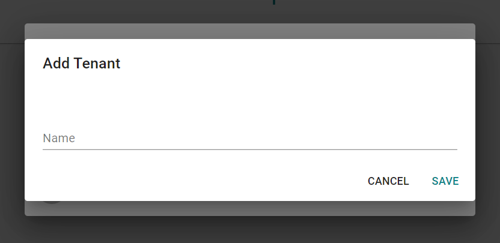

# Multi-Tenancy

## What is Multi-Tenancy?

Multi-tenancy is an architecture that allows a single application to be used by multiple customers. This means that data in the application is scoped to the current customer and not visible to other customers of the application. An example of this is rhe university's use of Microsoft's suite of applications. In this case, the university has their own tenant. This tenant contains all of the data specific

## Multi-Tenancy in this application

Multi-tenancy in this application involves scoping rules, devices, and device groups to tenants. This allows multiple customers to use the application without other customers seeing their data. Users can then belong to multiple tenants, allowing them to view and manage their data.

### Creating a Tenant

When first creating an account a new tenant is created for you, allowing you to get started creating rules and adding devices. You may want to add another tenant in order to keep unrelated data separate - e.g., keeping rules and devices for each building in their own tenant. This can be done by clicking the 'Switch Tenant' button in the left drawer and then selecting 'Create a new tenant'.

## Next Steps

* Learn how to [manage users](users.md) within tenants
* Find out how to [add and manage devices](devices.md)