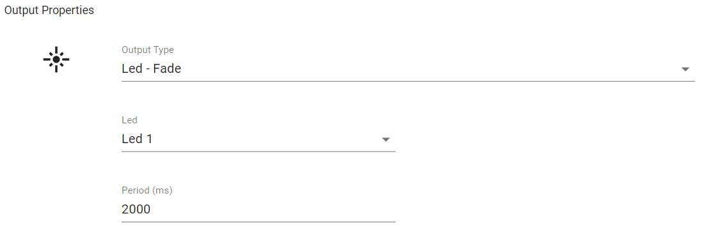

# Rules

Rules are the core functionality of the system, allowing inputs from devices to trigger outputs.

## Creating Rules

Navigate to the rules page and press the add button to create a new rule. The rule form is shown below:

The form is composed of 3 sections: Name, Trigger, and Outputs.

## Trigger

The Rule trigger is the device input that will trigger the rule and cause the outputs to be performed. This is composed of the input type and parameters desired, and the device or device group the input will come from. If a device group is chosen, an input matching the desired type and parameters from any of the groups devices will trigger the rule.

There are several input types that can be chosen:

### Input Types
#### Button Pushed

This input is sent when the button is pushed on a device. The duration desired to trigger the rule can be set to one of three values:

* **Short Press** - 0s < 2s
* **Medium Press** - 2s < 10s
* **Long Press** - > 10s

#### Switch Flipped

This input allows rules to be triggered when one of the 2 switches on the device are flipped. The peripheral (switch 1 or 2) can be chosen and the switch state. The switch state is used to specify whether the switch should be triggered when the switch is flipped to an on or off state.

#### Potentiometer

This input allows you to specify a range of potentiometer values that will trigger the rule. The default configuration is a range between two values but this can also be inverted to allow for specifying a range of values less than the lower value *or* greater than the higher value. This can be done by pressing the button between the values, or manually setting the greater than value to be higher than the less than.

When using a potentiometer value as an input it should be noted that the rule will not be triggered every time the potentiometer value changes if it is within the trigger range. Instead, the system keeps track of the last potentiometer value sent by the device and only triggers the rule if the last value was outwith the range and the new value is within it.

#### Temperature

This input allows you to use the temperature sensor on your device as a trigger for the rule. It functions in a similar way to the potentiometer trigger, with a range picker. Again this range can be inverted, and the rule is only triggered when the last value did not satisfy the conditions.

#### Web Hooks

This is an input that can be triggered via the invocation of a generated URL, commonly known as a web hook. It works similar to a physical input such as a button press, but instead of being triggered upon the button being pressed, the trigger happens upon invocation of the URL. After adding a rule with a web hook as an input, from the rules page on the website, find the added rule from which the invoke URL can be garnered. Below is an example of what this looks like. For more information for developers and using web hooks for interoperability please see [here](webhooks.md).

## Outputs

These are the outputs that will be performed when a rule is triggered. Multiple outputs can be performed for each rule.

##### Output Types

### Buzzer - On

This output is used to sound a continuous buzzer tone for the specified duration.

### Buzzer - Beep

This output beeps the buzzer with the duty cycle specified. The minimum values for the on and off duration are 200ms.

### LED - Output

This output can be used to turn an LED on or off. There are 3 LEDs that can be selected, corresponding to the LEDs on the MSP430G2553. As such, LEDs 1 and 2 are single colour, but a colour - *Red, Green, Blue, Purple, Yellow, White* - can be chosen when LED 3 is selected.

This choice of colour also applies to the other output types involving LED 3.

### LED - Blink

This output blinks the LED with the specified period.

### LED - Breathe

This output makes the LED 'breathe' by smoothly changing the brightness from zero to full brightness and back again, and then repeats. The period of this breathing can be configured.

### LED - Fade

This output fades the LED off over a given period of time.

### LED - Cycle

This output applies only to LED 3 as it cycles through all possible colours. The direction of the cycle can be chosen along with the period - the total amount of time it will take to cycle through all colours

### Web Hooks

This ouput sends an HTTP post request to the specified URL. The `Forward Message` option allows for the message body of the input on this rule to be forwarded to the specified URL. For example, if the input was also a web hook that posted some payload in the body, this will be retained and posted to the specified URL. If it was a button press as the input, the MQTT JSON message also gets forwarded. For more information for developers and using web hooks for interoperability please see [here](webhooks.md).

