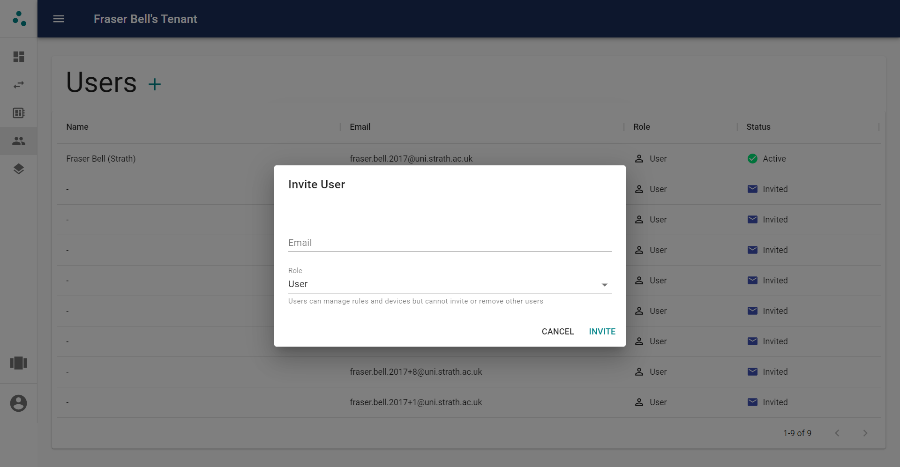

# Users

## Roles

Users can have one of two roles within a tenant:

* **User** - Users with this role can manage devices, rules, and device groups. However, they cannot manage users belonging to the tenant or edit the tenant itself.
* **Owner** - This user has full control over the tenant. They can manage everything a user can, along with inviting and removing users and editing the tenant.

## Inviting Users

Users can be invited to tenants by their email address. If the user already has an account, they will have immediate access to the tenant and receive an email telling them that they have been invited to your tenant. If they have not yet created an account they will receive an email informing them they have been invited to your tenant, including a link to sign up.